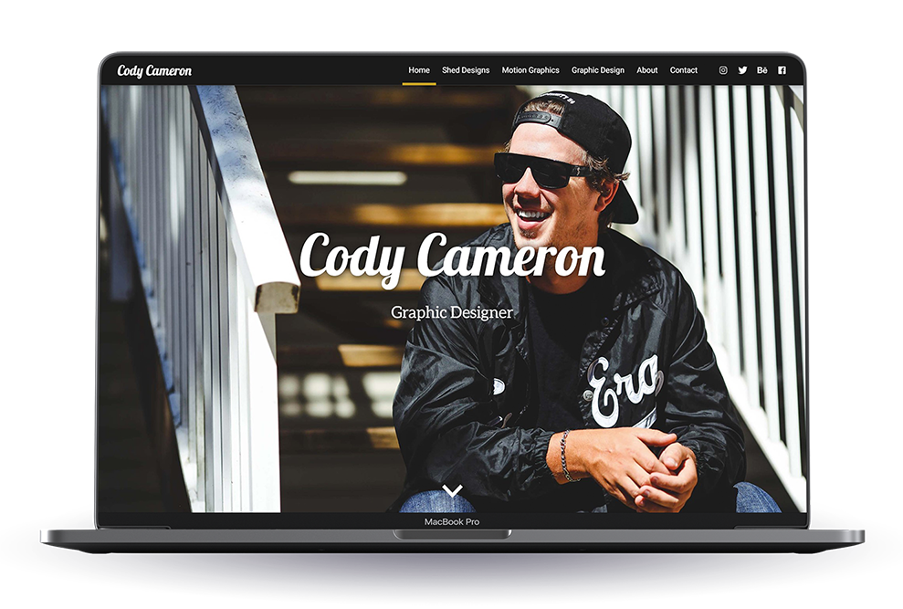

  

<h1 align="center">
  Cody Cameron
</h1>
<h3 align="center">
  Artist Portfolio Website
</h3>

This is a portfolio website made for artist Cody Cameron. It was developed using the <a href="https://jamstack.org/">JAMstack</a>.

# 

  

## :cloud: Hosting
The site is hosted publicly at https://eloquent-wozniak-860d04.netlify.com/.

## :hammer_and_wrench: Technologies Used
The following tools were used to develop this project:
* [React](https://reactjs.org/)
* [GraphQL](https://graphql.org/)
* [GatsbyJS](https://www.gatsbyjs.org/)
* [Contentful CMS](https://www.contentful.com/)
* [Netlify](https://www.netlify.com/)
* [Styled Components](https://www.styled-components.com/)
* [Axios](https://github.com/axios/axios)
* [React Alice Carousel](https://www.npmjs.com/package/react-alice-carousel)
* [React Icons](https://react-icons.netlify.com/#/)

## :wave: Contact
Built by [Anthony Caron](https://github.com/antcar112) - Feel free to reach out and contact me if you have any questions. 